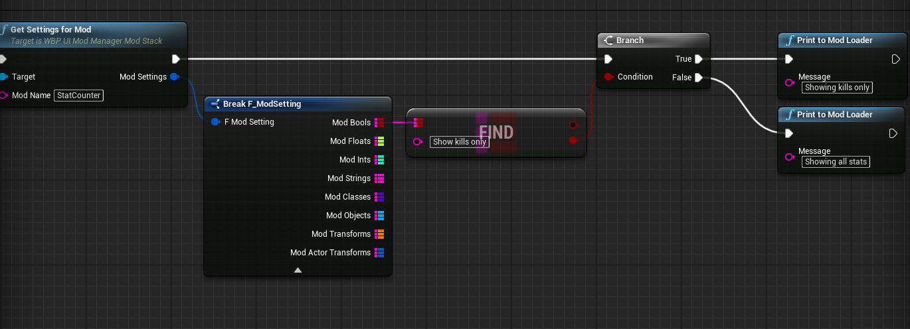

# Mercury Mod Manager Modding guide

Before continuing through this guide, keep in mind Mercury Mod Manager is currently *still in development*!

## Setting up settings for your mod
### Preparing mod assets
Make sure to grab the `BP/PAYDAY3/Content/Mods/Mercury/ModSettings/ExampleModSetting.uasset` from this repository, mod setting DataAssets are based on it. Give it as well as any copies of its class you make in the `.../Mercury/Modsettings` directory.  
You also need `/Mercury/Blueprints/BP_ModManager.uasset`, `/Mercury/Blueprints/PDA_Settings.uasset`, and `/Mercury/UI/Widgets/WBP_UI_ModManager_ModStack.uasset`.  
Keep in mind you **do** still need the ModMeta that `zModLoader_P` uses.

### Modifying Setting DataAssets

Above is how the basic ExampleModSetting looks, make a copy of it for each functionality mod with settings you have and make sure to include it in your mod pak when packing your mod for testing or publishing.

The Mod Name input speaks for itself, pay attention to capitalisation, as you will need to remember how exactly it is written for your blueprint(s).

The Mod Icon input should have an icon selected that is packed within your mod pak, if you have no icon, you should keep the default. Make sure that this value is a reference to a `Sprite` object. **The size of the icon sprite has to be 512x128 pixels to fit!**

And finally - Mod Settings - these inputs are maps, in which you can add a setting and give it a name and default value. These setting names will appear in the settings menu in-game and you will need them to find the right setting in your blueprints.

### Making Settings Work In-Game
In any blueprint or widget blueprint you can import Mercury and get settings from it, here's an example of how to do it:

As seen above, you first need to get all actors of class `BP_ModManager`. There will only be one (and this is what you need a copy of it for in your project). You should ge the value of the first index, which will be the BP_ModManager. You can then proceed to get the ModStack property of the `BP_ModManager`. From there you can call the function `Get Settings for Mod`, and pass your mod name to it. **Make sure that name is identical to the one you filled in in the Setting DataAsset**.

You can now break the resulting settings, and get the map your setting is in, and finding your setting by its name which you specified in the Setting DataAsset.  
To end things off, you can check the value of the setting and do something depending on the value.
